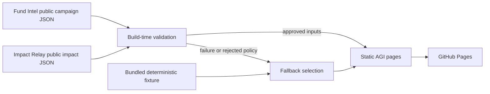

# Architecture

## System overview

AGI is a static Next.js App Router application. GitHub Actions builds the site from `main`, retrieves approved public aggregate signals during that build, exports static files to `out/`, and deploys them to GitHub Pages.

The deployed browser receives only static HTML, CSS, JavaScript, brand assets, and the selected public-safe projection. It does not call Fund Intel or Impact Relay at runtime.

## Runtime and deployment model

- **Framework:** Next.js 16 App Router with React 19 and TypeScript.
- **Output:** static export (`output: "export"`), Turbopack production build by default.
- **Hosting:** **Vercel** production at **https://autogive.app**; GitHub Pages remains a github.io fallback.
- **Build:** Node.js 22; static export to `out/` at site root (`basePath` empty). See [VERCEL.md](VERCEL.md).
- **State:** local React state for the replayable demonstration; no persistence.
- **External data:** two fixed HTTPS sources fetched at build time with a bundled fallback.

`site.ts` owns the canonical production origin (`https://autogive.app`). `next.config.ts` defaults to an empty base path so the custom domain serves assets from `/`. DNS and Pages setup: [CUSTOM-DOMAIN.md](CUSTOM-DOMAIN.md).

## Component boundaries

| Path                            | Responsibility                                                        |
| ------------------------------- | --------------------------------------------------------------------- |
| `app/page.tsx`                  | Composes the public narrative and requests validated public signals   |
| `components/public-signals.tsx` | Renders the selected live or fallback aggregate projection            |
| `components/donation-demo.tsx`  | Runs the deterministic, non-payment contribution story                |
| `components/navbar.tsx`         | Provides AGI and reciprocal suite navigation                          |
| `demo/scenario.ts`              | Defines the canonical local demonstration state                       |
| `integration/public-sources.ts` | Fetches, validates, selects, and normalizes public projections        |
| `integration/contracts.ts`      | Defines versioned narrative contracts for future governed integration |
| `integration/fixtures.ts`       | Supplies public-safe deterministic contract fixtures                  |
| `tokens.css`                    | Defines visual tokens shared by the application                       |

The page component is the server entry point. Interactive state stays in focused client components rather than moving the whole page to the client.

## Trust boundaries

Fund Intel and Impact Relay documents are external, untrusted input even though they come from repositories in the same suite. The adapter must:

1. require successful HTTP responses;
2. require Fund Intel authority `advisory_only`;
3. require Impact Relay authority `public_aggregate_only`;
4. select only an outcome whose evidence state is `VERIFIED`;
5. return the deterministic fixture on any fetch, parse, policy, or evidence failure.

The site never requests donor identity, contact details, payment records, raw receipts, private documents, or secret evidence URLs. `verified` means the source published an approved aggregate verification state; it does not establish one-to-one attribution to a donor.

## Failure behavior

The application is designed to remain honest and available when external data is not:

- unavailable source → deterministic fallback;
- non-2xx response → deterministic fallback;
- malformed JSON → deterministic fallback;
- unexpected authority → deterministic fallback;
- no verified outcome → deterministic fallback.

The UI labels the result as either `Live public projection` or `Deterministic fallback`. Freshness and more granular rejection states remain planned work; see [CONTINUATION_PLAN.md](CONTINUATION_PLAN.md).

## Deliberate exclusions

The current architecture has no backend, authentication, database, payment processing, CMS, donor account, runtime write operation, or notification delivery. Adding any of these changes the threat model and requires a separately reviewed architecture plan.
